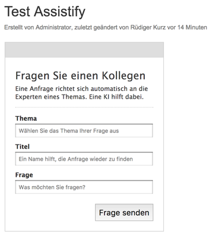
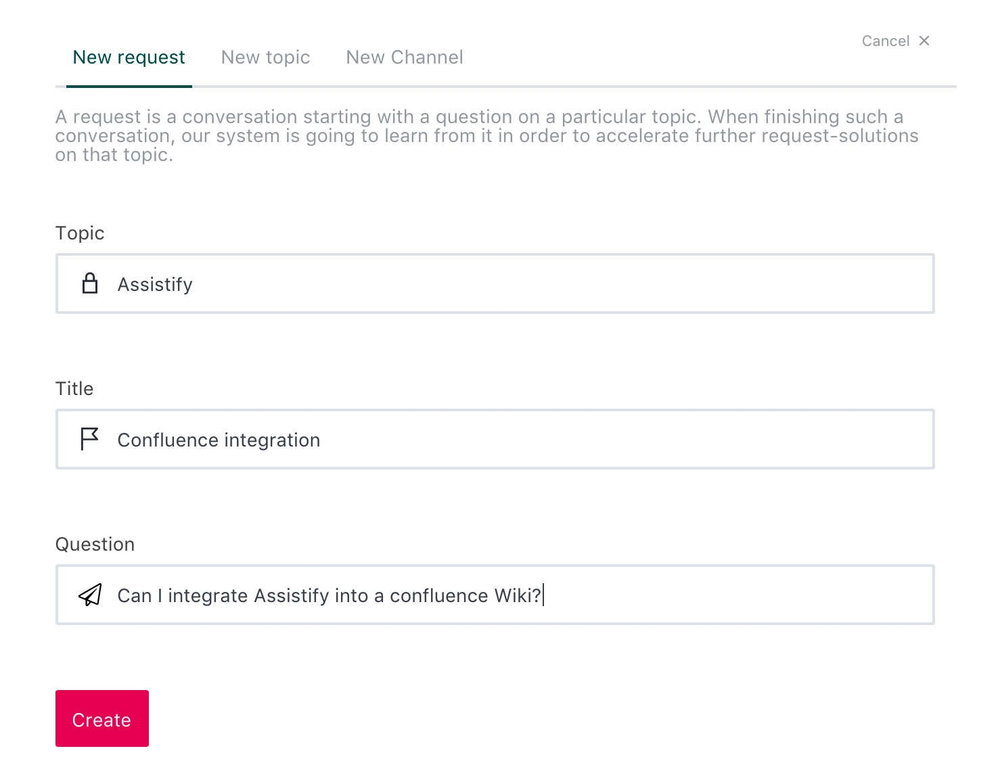
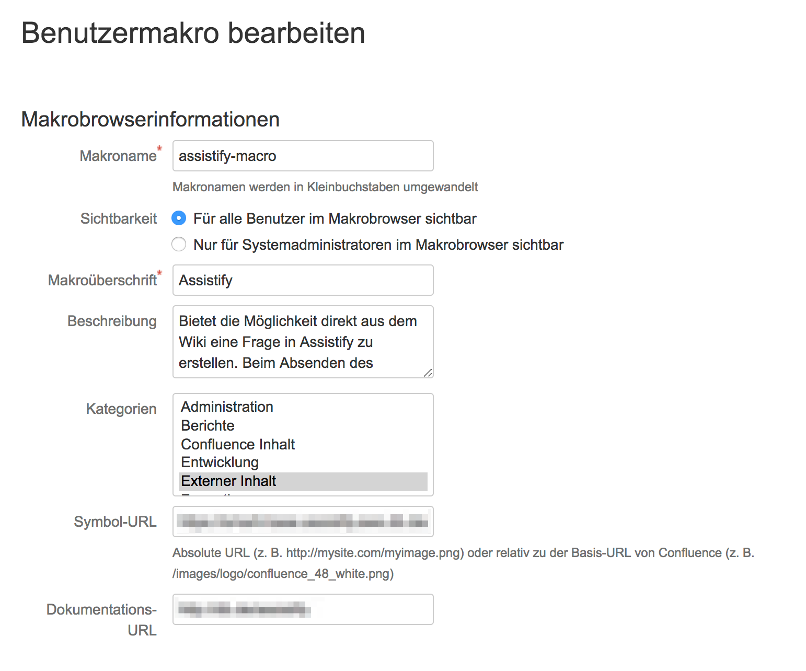
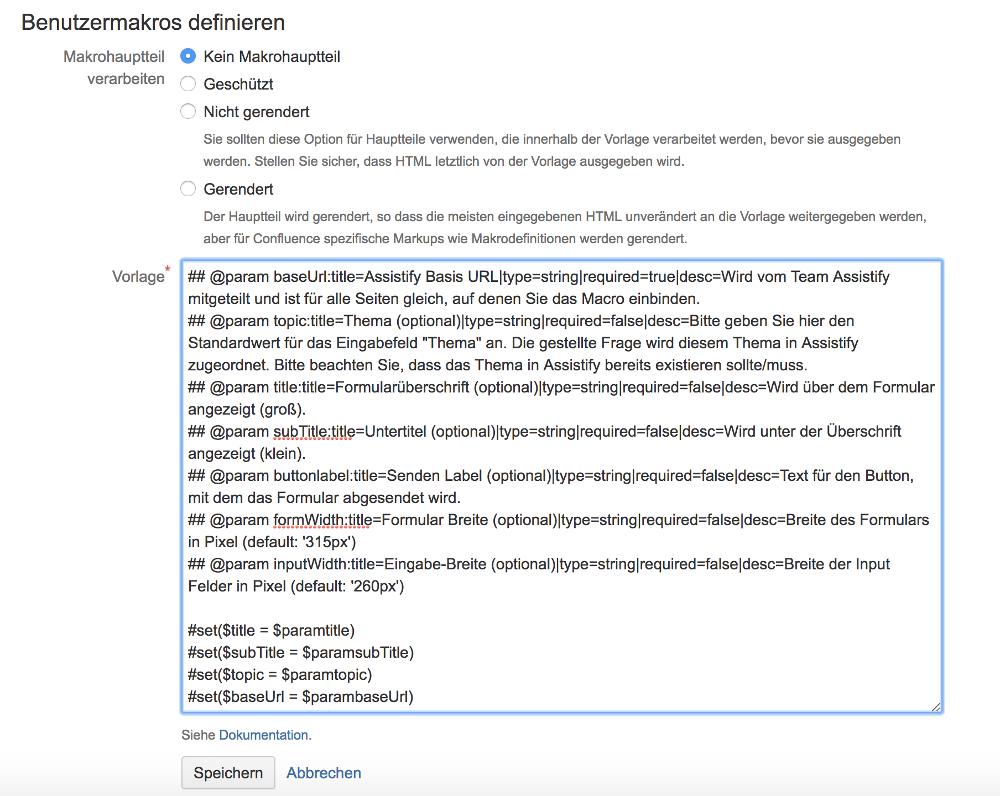
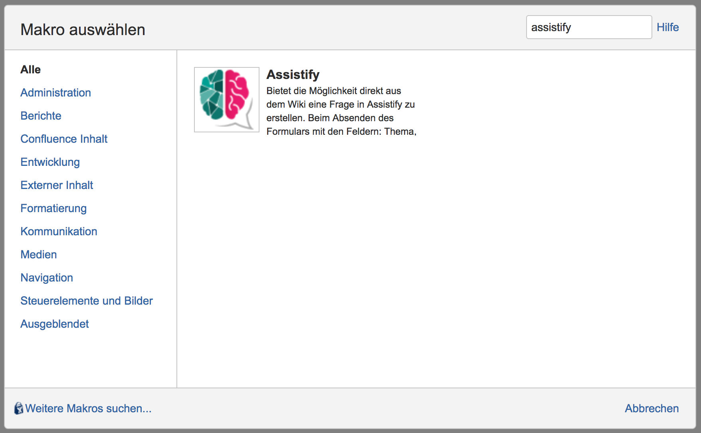
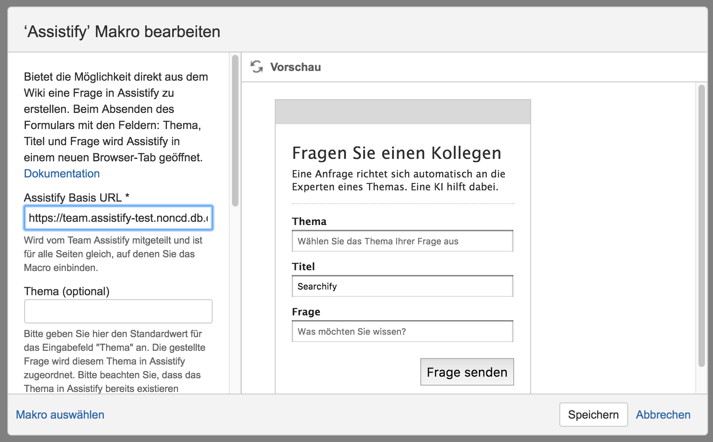

= confluence-integration
Assistify <info@assistify.de>
v1.0, 2017-12-07

Integrates Assistify into Atlassian's popular wiki-platform

== Use Case

The request mode of Assistify should be triggered inside the user's context
E.g. directly from a SAP system or a confluence instance where the question comes up.
This confluence user macro provides a form that opens the pre-filled request dialog within Assistiy by submitting the form.



The input form is provided by this macro and can be placed on each Wiki page.

== How it works

By submitting the form the input values are passed to Assistify as request parameters of a specific URL:

```
https://${baseUrl}/create-channel/?topic=${topic-input-value}&title=${title-input-value}&question=${question-input-value}
```

After submit this form Assistify request dialog opens in a new browser tab



== How to create the user macro

. Goto user macros within your confluence installation
. Create a new user macro
. Enter the "macro browser information" as follows:
.. Macro name: assistify-macro
.. Visibility: Visible to all users in the macro browser
.. Headline: Assistify
.. Description: Provides the ability to create a question directly from the Wiki in Assistify. When submitting the form with the fields: Subject, Title and Question, Assistify opens in a new browser tab.
.. Category: external content
.. Symbol-URL: ${A Url to an icon}
.. Documenation-URL: https://github.com/assistify/confluence-integration



. Define the user macro as follows:
.. Select "no macro main section"
.. Insert the file content from this repository as template: link:assistify-user-macro[Assistify User Macro]




== How to add the macro onto a Wiki page

=== Macro Usage

1. Edit a Wiki Page
2. Use the '+' in the confluence menu
3. Select 'other macros'
4. Search for 'Assistify'
5. Enter the 'Settings'



=== Macro configuration options

The macro offers the following configuration parameters:

- $title - display title of the form
- $subTitle - sub title of the form
- $topic - default value of the topic
- $baseUrl - assistify base url
- $buttonlabel - label text for the submit button
- $formWidth - width of the form
- $inputWidth - width of the input fields within the form


